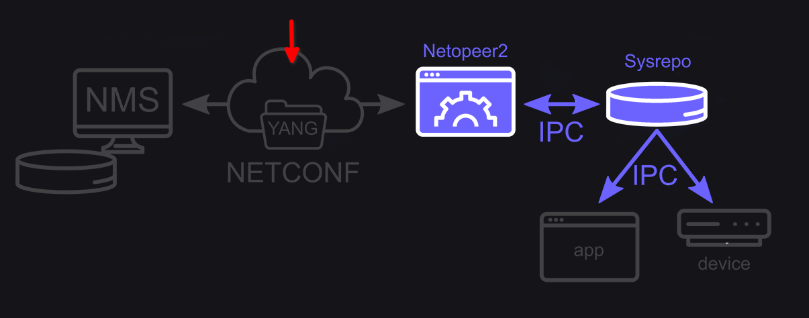
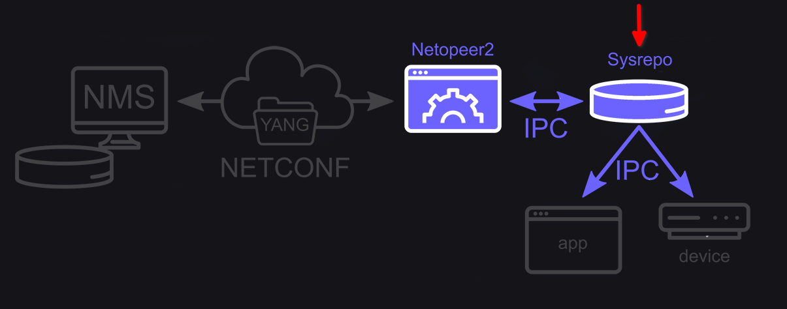
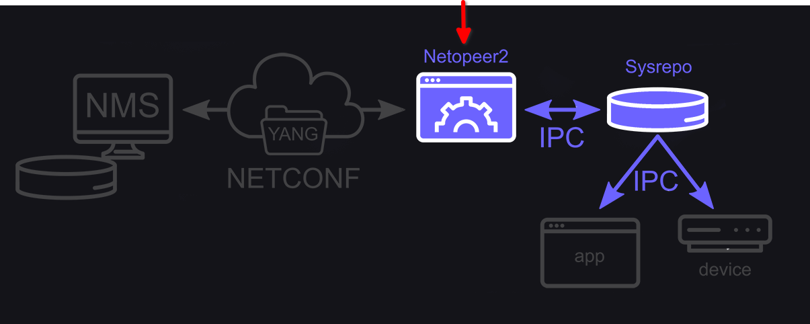

# Qualcomm project preparation

## Introduction

This document collects all the different frameworks/technologies/concepts used in the Qualcomm project and tries to introduce them in an accessible step-by-step manner. 

## NMS: Network Management System

> Networks and distributed processing systems are of critical and growing importance in enterprices of all sorts. The trend is toward larger, more complex networks supporting more applications and more users. As these networks grow in scale, two facts become painfully evident:
> - The network and its associated resources and distributed applications become indispendable to the organization.
> - More things can go wrong, disabling the network or a portion of the network or degrading performance to an unacceptable level.
>
> A large network cannot be put together and managed by human effort alone. The complexity of such a system dictates the use of automated network management tools. The urgency of the need of such tools is increased, and the difficulty of supplying such tools is also increased, if the network includes equipment from **multiple vendors**.

[Source](https://www.usi.edu/business/aforough/Chapter%2020.pdf)

## OpenRAN: Open Radio Access Network

> The mobile, or cellular/wireless network comprises two domains: the Radio Access Network (RAN) and the Core Network (Core).
> 
> The RAN is the final link between the network and the phone. It is the visible piece and includes the antennae we see on towers, on top of buildings, or in stadia, plus the base stations. When we make a call or connect to a remote server e.g., to watch a Youtube video, the antenna transmits and receives signals to and from our phones or other hand-held devices. The signal is then digitalized in the RAN base station and connected to the network. 
>
> The Core has many functions. It provides access controls ensuring users are authenticated for the services they are using, it routes telephone calls over the public switched telephone network, it enables operators to charge for calls and data use, and it connects users to the rest of the world via the Internet.
>
> Whilst it was possible for operators to have one vendor for their core network and a separate vendor for the RAN, interoperability between RAN equipment from different vendors was deprioritized at the expense of adding overall functional capability. As a result, with current solutions, it is difficult to mix vendors for the radio and baseband unit, and in most cases, they come from the same supplier.
>
> OpenRAN looks to change this and enable operators to mix and match components and goes one step further by opening the interfaces inside the base station.

[Source](https://www.nokia.com/about-us/newsroom/articles/open-ran-explained/)

## NETCONF: Network Configuration Protocol

> NETCONF provides mechanisms to install, manipulate, and delete the configuration of network devices. Its operations are realized on top of a simple Remote Procedure Call (RPC) layer. The NETCONF protocol uses an Extensible Markup Language (XML) based data encoding for the configuration data as well as the protocol messages. The protocol messages are exchanged on top of a secure transport protocol. 

[Source](https://en.wikipedia.org/wiki/NETCONF)

- [NETCONF I](https://ultraconfig.com.au/blog/introduction-to-netconf-and-juniper-yang-models/)
- [NETCONF II](https://ultraconfig.com.au/blog/how-to-configure-juniper-routers-with-netconf-via-xml-rpcs/)
- [Optional read: RESTCONF (alternative to NETCONF)](https://ultraconfig.com.au/blog/restconf-tutorial-everything-you-need-to-know-about-restconf-in-2020/)

### YANG: Yet Another Next Generation

> As I'm sure you've noticed, we are living in a time of explosive growth for the network automation industry. A core component of modern automation technology is the language YANG. 
>
> YANG is a language used to describe data models of network devices. What is a data model of a network device? To answer that, let's imagine a hypothetical scenario where your friends asks you what IP interface attributes can be configured on a specific router. You might say: "To configure an interface on this router, you need to supply: an interface name, an IP address, and a subnet mask. You also need to enable the interface - the router will keep the interface disabled if you don't."
> 
> We just described a data model for an IP interface. A YANG model will do the same but uses strict syntax rules to make the model stadardized and easy to process with computers.

[Source](https://ultraconfig.com.au/blog/learn-yang-full-tutorial-for-beginners/)

[Exercise 1: yang](exercise-1-yang.md)

## Sysrepo

> Sysrepo is a YANG-based datastore for Unix/Linux systems. Applications that have their configuration modelled using YANG can use Sysrepo for its management.

[Intro Sysrepo](intro-sysrepo.md)

## Netopeer2

> Netopeer2 is a server implementing network configuration management based on the NETCONF protocol. Is based on the NETCONF and YANG libraries - [libnetconf2](https://github.com/CESNET/libnetconf2) and [libyang](https://github.com/CESNET/libyang). Uses [sysrepo](https://github.com/sysrepo/sysrepo) as a NETCONF datastore implementation. 

[Source](https://github.com/CESNET/netopeer2)

- [Intro Netopeer2](intro-netopeer2.md)
  - [Exercise 2: Oven plugin](exercise-2-oven-plugin.md)

## Random stuff

[Sysrepo: developer guide](sysrepo-developer-guide.md)

[Exercise 3: Docker setup](exercise-3-docker-setup.md)