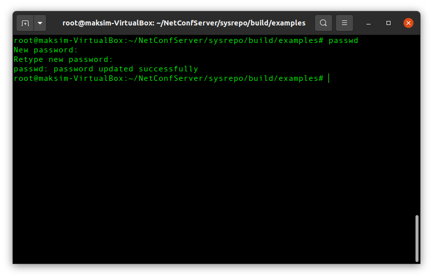
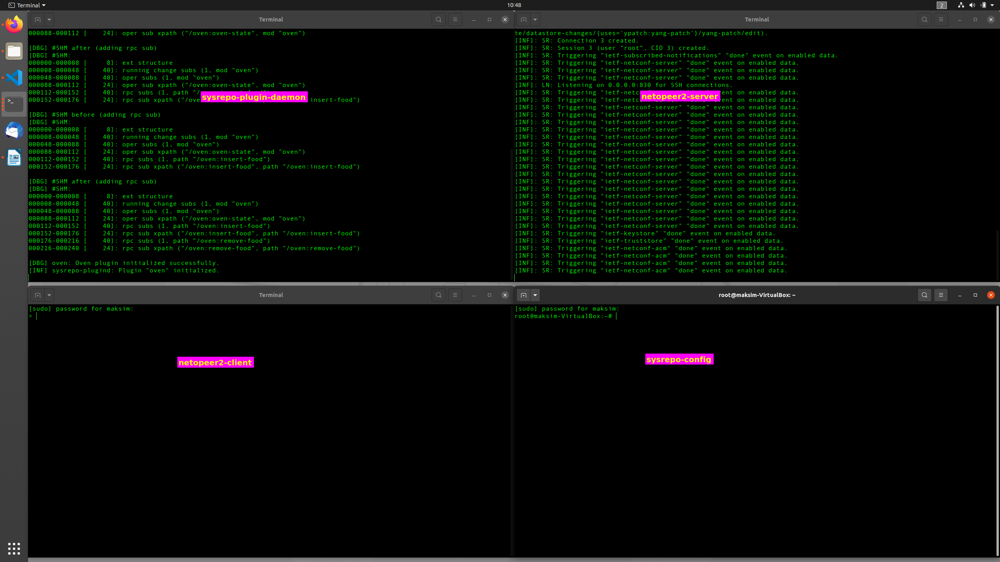
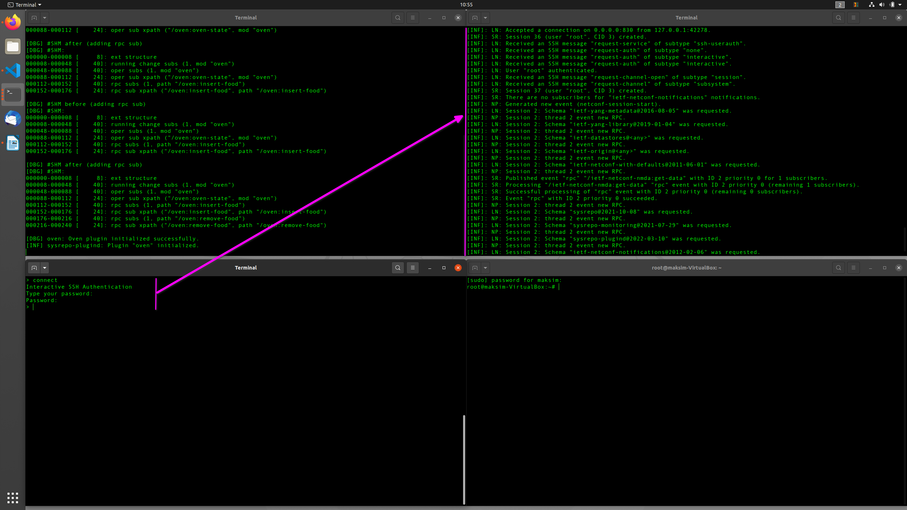
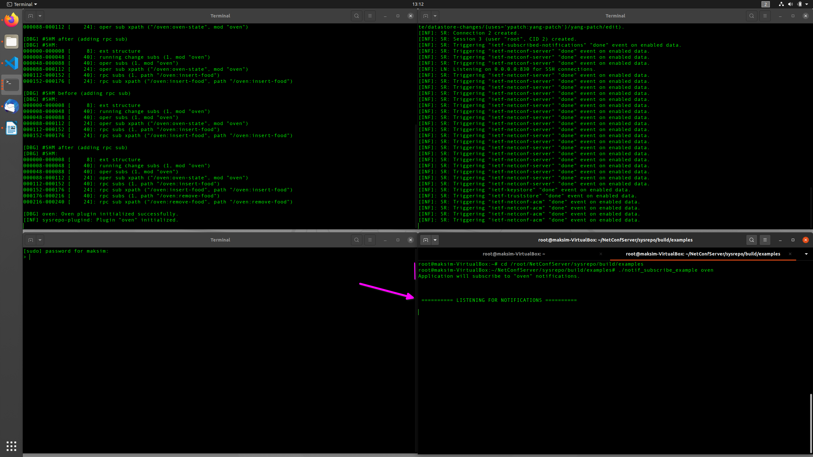
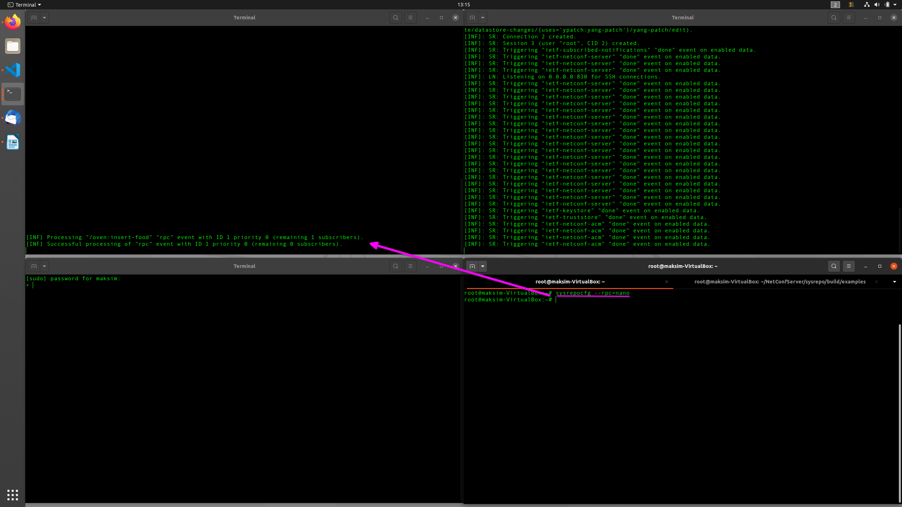
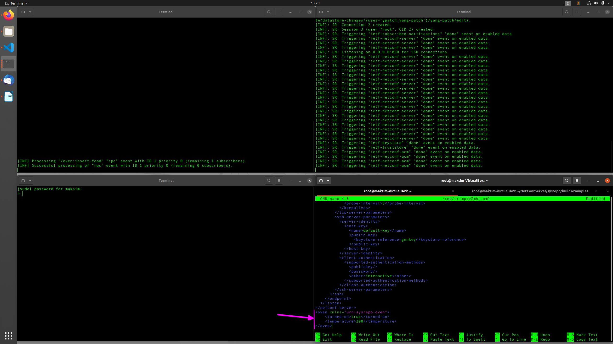
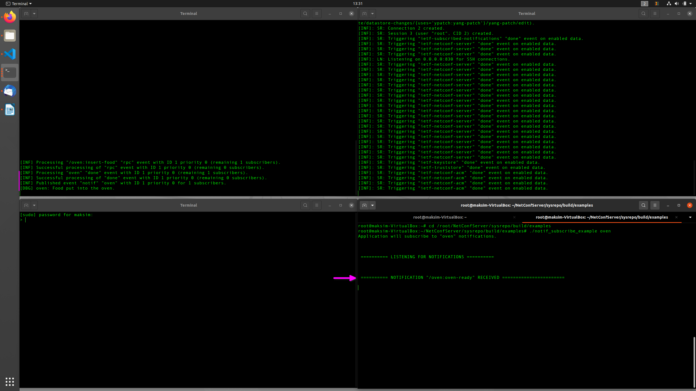
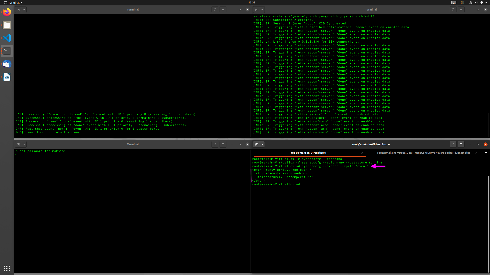
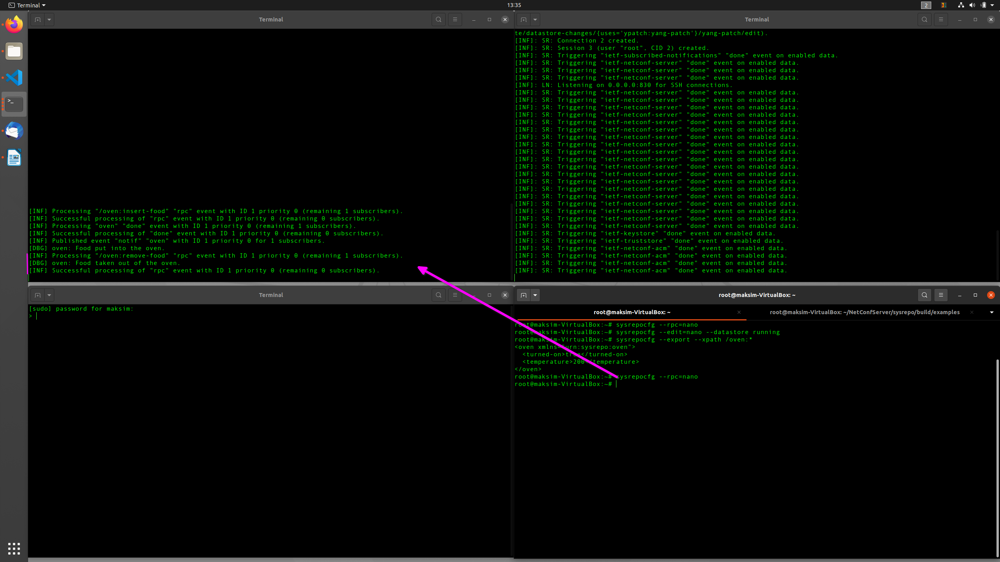

# Oven plugin

- [Source 1](https://netopeer.liberouter.org/doc/sysrepo/master/html/example.html)
- [Source 2](Qualcomm test environment.docx)

## Plugin Example

This page includes a guide on how to write a simple YANG module and then get Sysrepo to handle its data either as a plugin or a stand-alone daemon. 

### Simple YANG module

### Oven Plugin

#### Initialization

In the initialization function you must generally initialize the device and create subscriptions to any relevant YANG nodes.

#### Cleanup

#### Configuration Data

#### State Data

#### RPC Subscriptions

#### Notifications

#### Trying it out

1. Setting up the oven plugin

    As root, command:

    ```
    sudo -i
    cd /root/NetConfServer/sysrepo/examples/plugin
    mkdir -p /usr/local/lib/sysrepo-plugind/plugins
    sysrepoctl -i oven.yang
    cd /root/NetConfServer/sysrepo/build/examples
    cp oven.so /usr/local/lib/sysrepo-plugind/plugins
    ```

    Set root password, netopeer2 client prompts for it.

    ```
    passwd
    ```



2. Setup: netopeer2-server, netopeer2-client, sysrepo-plugin-daemon and sysrepo-config

    Open **four** terminals as root. In the first three command: (This step can also be done by executing `qc-setup.sh`, pro-tip: use a seperate workspace)

    1. `sysrepo-plugind -d -v4`
    2. `netopeer2-server -d -v3`
    3. `netopeer2-cli -v3`
    4. This terminal is used for sysrepocfg, no commands to be issued yet.

    Now your workspace should look something like this:

    

    In netopeer2-client terminal:

    View help:

    ```
    help
    ```

    Connect to netopeer2-server, give root password when prompted. Netopeer2-server should achnowledge the login attempt.

    ```
    connect
    ```

    

    Get the running netopeer2-server configuration:

    ```
    get-config --source running
    ```

    Output:

    ```xml
    DATA
    <data xmlns="urn:ietf:params:xml:ns:netconf:base:1.0">
    <keystore xmlns="urn:ietf:params:xml:ns:yang:ietf-keystore">
        <asymmetric-keys>
        <asymmetric-key>
            <name>genkey</name>
            <algorithm>rsa2048</algorithm>
            <public-key>...</private-key>
        </asymmetric-key>
        </asymmetric-keys>
    </keystore>
    <netconf-server xmlns="urn:ietf:params:xml:ns:yang:ietf-netconf-server">
        <listen>
        <endpoint>
            <name>default-ssh</name>
            <ssh>
            <tcp-server-parameters>
                <local-address>0.0.0.0</local-address>
                <keepalives>
                <idle-time>1</idle-time>
                <max-probes>10</max-probes>
                <probe-interval>5</probe-interval>
                </keepalives>
            </tcp-server-parameters>
            <ssh-server-parameters>
                <server-identity>
                <host-key>
                    <name>default-key</name>
                    <public-key>
                    <keystore-reference>genkey</keystore-reference>
                    </public-key>
                </host-key>
                </server-identity>
                <client-authentication>
                <supported-authentication-methods>
                    <publickey/>
                    <passsword/>
                    <other>interactive</other>
                </supported-authentication-methods>
                </client-authentication>
            </ssh-server-parameters>
            </ssh>
        </endpoint>
        </listen>
    </netconf-server>
    </data>
    ```

3. Subscribe to oven notifications using `notif_subscribe_example` (open seperate tab in `sysrepo-config`)

```
sudo -i
cd /root/NetConfServer/sysrepo/build/examples
./notif_subscribe_example oven
```



4. Prepare food to be inserted into the oven once it reaches a temperature, which will be configured later. The oven is turned on by default. In NETCONF terms, you execute the `insert-food` RPC. You can do that using `sysrepocfg`

```
sysrepocfg --rpc=nano
```

And input

```xml
<insert-food xmlns="urn:sysrepo:oven">
    <time>on-oven-ready</time>
</insert-food>
```

as the RPC content. You should see some informational sysrepo-plugind output



5. Now you are going to turn the oven on and expect to be notified once it reaches the configured temperature. Also, the food should be inserted at that moment. So, you execute 

```
sysrepocfg --edit=nano --datastore running
```

with the content

```xml
<oven xmlns="urn:sysrepo:oven">
    <turned-on>true</turned-on>
    <temperature>200</temperature>
</oven>
```



6. After ~4 seconds you should receive the notification. You can also verify that everything went correcly with 



```
sysrepocfg --export --xpath /oven:*
```



The food should be inside the oven.

1. Once you think the food is baked just right, remove it with another RPC by 

```
sysrepocfg --rpc=nano
```

with 

```
<remove-food xmlns="urn:sysrepo:oven"/>
```



#### Oven daemon

