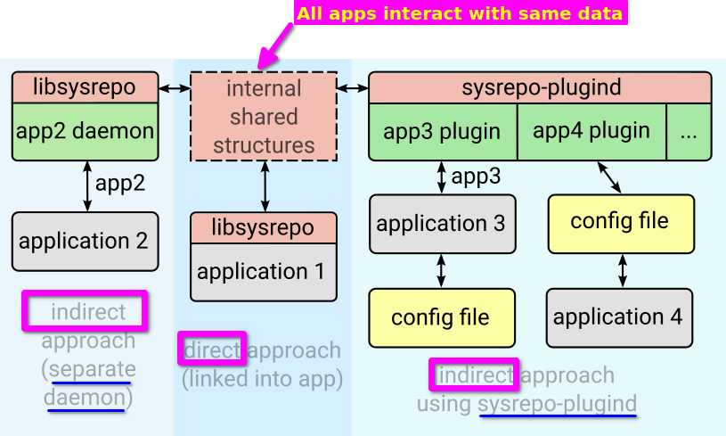

# sysrepo

Source: [link](https://netopeer.liberouter.org/doc/sysrepo/master/html/)

## Introduction

Sysrepo is a YANG-based datastore for Unix/Linux systems. Applications that have their configuration modelled using YANG can use Sysrepo for its manamgement. 

There are 2 main approaches for applicaitons to make use of Sysrepo.

- **Direct approach** - involves calling Sysrepo functions from the application itself whenever configuration data are needed or executing specific callbacks to react to configuration changes.

- **Indirect approach** - is usually simpler to employ for existing applications because then they do not need to be changed themselves to utilize Sysrepo datastore at the cost of having an additional intermediary process (daemon). If there are several such daemons, they can written as _plugins_ and then managed by one process.

## Main features

- before any operation: a **connection and session** needs to be created
- **manipulation** with YANG data
- **subscribing** to various **events**
  - most useful: **change** subscriptions - actions based on specific data changes using callbacks
  - **RPC/action (Remote Procedure Call)** 
  - **notifications**
- **logging**
- **editing data**: simple but requires basic knowledge of XPath for addressing individual data nodes
- **getting data**: also uses XPath but for this purpose almost any valid expression can be used
  - if **exclusive access** to certain data is required, **locking** is available

## Datastores

- follow the architecture defined by Network Management Datastore Architecture (NMDA)
- specifically:
  - startup
  - running
  - candidate
  - operational
- **startup** datastore - is the only persistent datastore. 
  - includes configuration of devices at time of their boot
  - copied into running when the first Sysrepo connection is created after system boot
- **running** datastore - holds the current system configuration
  - is edited when a configuration change occurs
  - does not persist across reboots
    - if desired, can be copied into _startup_ to rectify this
- **candidate** datastore - is meant to be a place to prepare configuration data without impacting the actual device
- **operational** datastore - maintains the currently used configuration
  - read-only and generally corresponds to _running_ with some possible differences
  - only this datastore includes any state data nodes
  - by default, empty, however data becomes a part of this datastore:
    - any subscribed _running_ data (in-use concept) will appear in _operational_ datastore
    - any operational data
  - all notification and RPC/action invocations are validated against this datastore
  
## Operational data

- Applications can provide operational data in 2 ways
  - pull
    - operation data is retrieved when they are needed so they are guaranteed to be up-to-date
    - operational subscription
    - suitable for data that changes often such as some counters or statistics
  - push
    - data need to be set only when they change
    - suitable for data that do not change often or not at all such as network interface state or basic information about the system

## Threading model

- sessions
  - not synchronized
  - must not be shared among multiple threads (each thread should create its own session)
- subscriptions
  - fully synchronized
  - makes no sense to process events of a single subscription in several threads (because all events on a single subscription are handled sequentially)
  - up to app to divide its events-of-interest into individual subscription structures to allow their concurrent handling (such as reacting to configuration changes while notifications are being received)

## Recovery

- uses shared memory
  - no automatic OS cleanup is performed in case an application crashes or does not properly terminate all its connections

## Access control

- sysrepo access control relies on file system permissions
  - specifically, read and write permissions for specific modules are checked 

## Path and XPath

- _xpath_ and _paths_ used as parameters for various Sysrepo API functions
  - XPath accepts any expression that _libyang_ does
    - libyang uses JSON module prefixes instead of XML prefixes of the module namespaces
  - Path - similar to _XPath_ defined above with some restrictions
    - follows JSON instance-identifier format (modules are strictly inherited from parents unless explicitly specified)