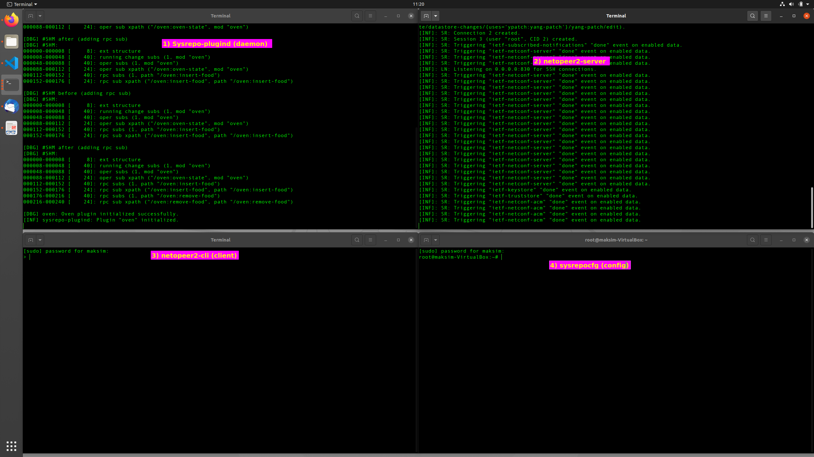
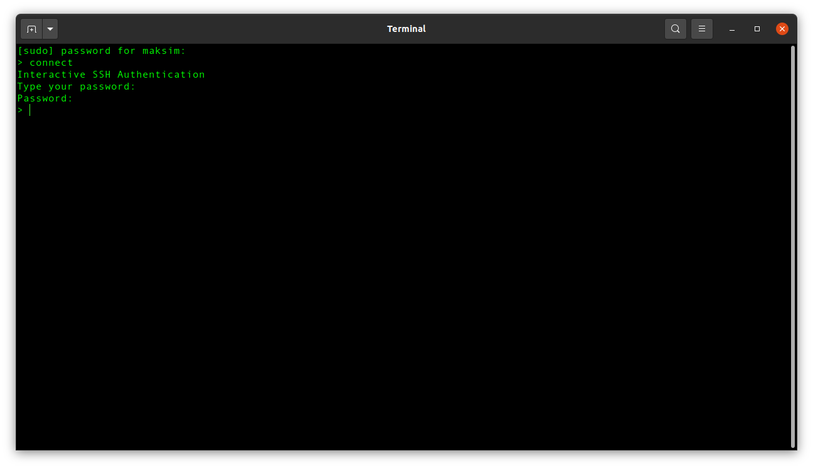
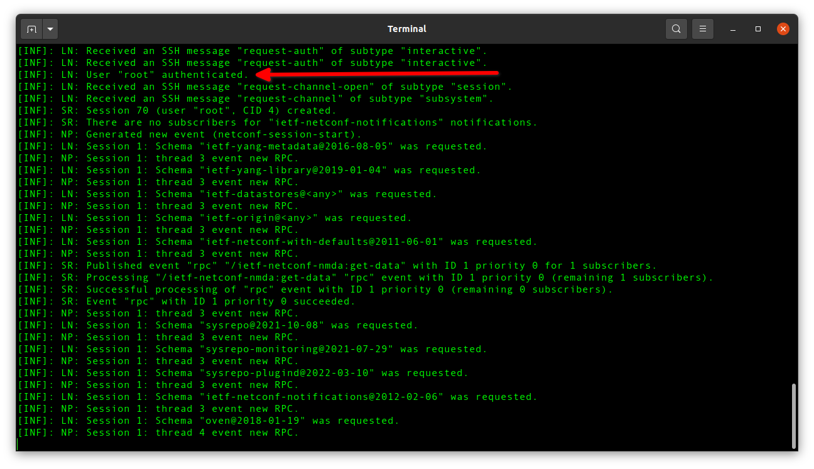
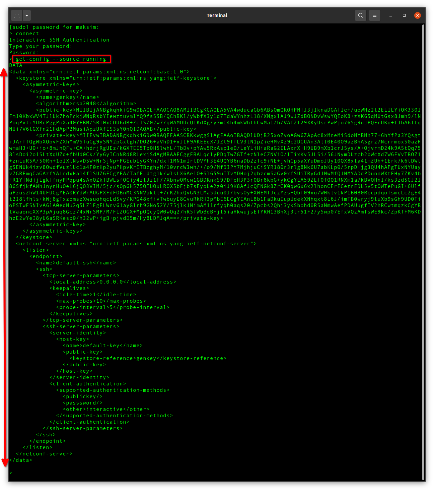
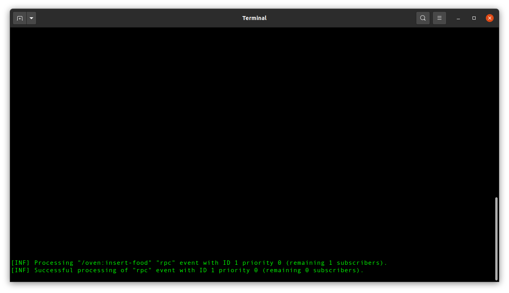
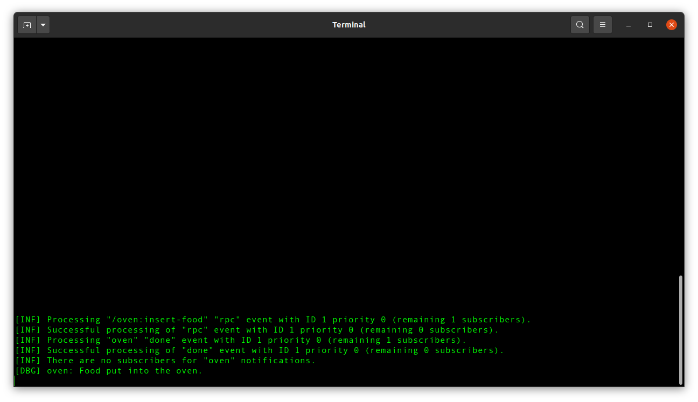
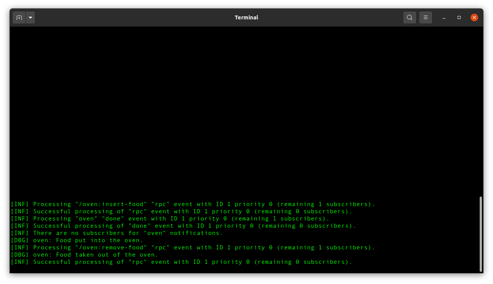
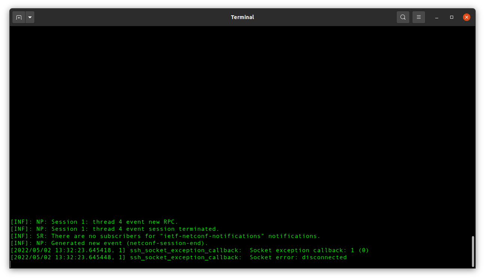

## Theory

The Qualcomm test environment is a **Sysrepo** ecosystem that consists of the following modules:

- **Netopeer2 CLI** (client) - Example command-line Netconf client that can be used as a simple Network Management System (NMS).
- **Netopeer2 NETCONF** (server) - Complement Sysrepo with the Open Source Netopeer2 NETCONF server to remotely manage applications via NETCONF. 
- **Sysrepoctl** (control) - Command line tool for changing YANG schemas of Sysrepo. That is installing, removing and updating schemas.
- **Sysrepocfg** (config) - Command line tool for stored YANG data management. This tool allows importing, exporting and editing configuration that complies with YANG schema.
- **Sysrepo-plugind** (daemon) - Simple daemon that groups all available Sysrepo plugins into a single process

## Setup

Copy `qc-setup.sh` to home directory and execute , this opens 4 terminal windows shown below (recommended to use a seperate workspace and use [WinTile](https://extensions.gnome.org/extension/1723/wintile-windows-10-window-tiling-for-gnome/) for window tiling): 



## Conenct oven example

1. Setup terminal windows as described above
2. In terminal "netopeer2-client": `connect`
   
    Netopeer2-client:

    

    Netopeer2-server:

    

3. Get the running netopeer2 server configuration: `get-config --source running`

    Netopeer2-client

    

4. Test the oven plugin executing a user remote procedure call. Command `user-rpc` opens a text editor where the XML is to be inserted. After the XML is saved and the editor is exited, "sysrepo-plugind" terminal should print some informational output.

    ```xml
    <insert-food xmlns="urn:sysrepo:oven">
        <time>on-oven-ready</time>
    </insert-food>
    ```

    sysrepo-plugind: 

    

5. In the fourth, currently unused terminal, edit the running sysrepo configuration to turn the oven on. We can use any text editor that is installed on the machine. The sysrepocfg command can be issued from any directory. `sysrepocfg --edit=vim --datastore running`

After ~4 seconds there should be a notification of the food being put into the oven.

    sysrepo-plugind:

    

6. To remove the food from the oven:

    sysrepo-plugind:

    

7. Disconnect the client from the server. In netopeer2-cli terminal: `disconnect`

    netopeer2-server

    

## Call home oven example